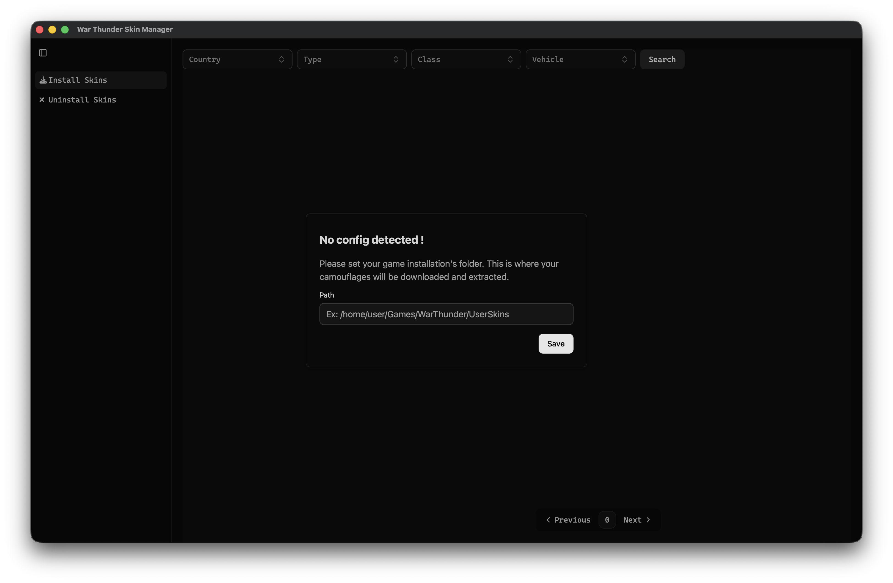
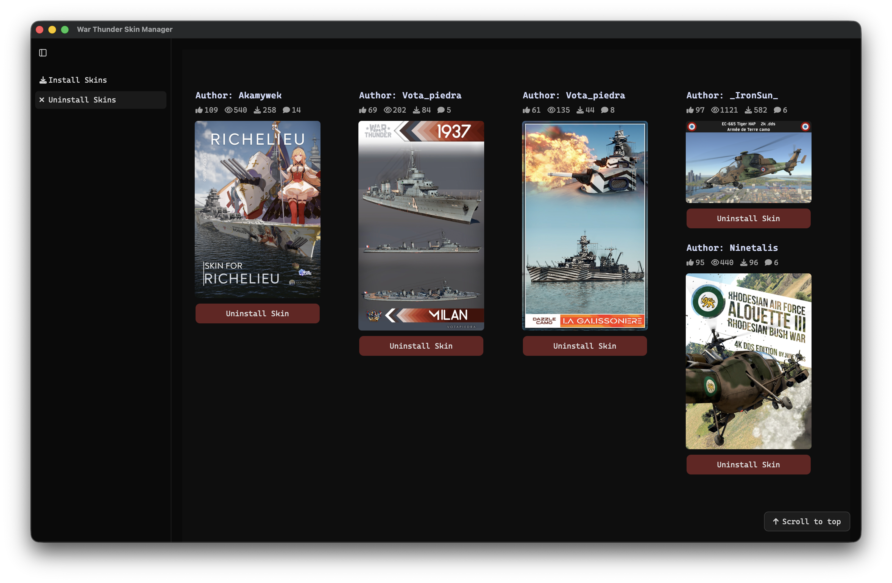

# War Thunder Skin Manager

War Thunder Skin Manager is a desktop utility designed to simplify the management of custom camouflages for War Thunder. By leveraging the [War Thunder Live API](https://live.warthunder.com/), you can browse, install, and uninstall skins directly from the application without any manual file manipulation.

When you click "Install", the application automatically downloads the archive and extracts it into your game's UserSkins folder. If an archive contains multiple subfolders or loose files, the manager automatically creates a dedicated root folder to prevent cluttering your game directory.

## Features & Usage

### 1. Configuration

Set your War Thunder installation directory to allow the manager to locate your `UserSkins` folder.



### 2. Search and Filter

Refine your research using the built-in filters to find the exact camouflage you are looking for.


### 3. One-Click Installation

Install the skins you want instantly. The application handles downloading, unzipping, and folder structuring.


### 4. Skin Uninstallation

Easily remove unwanted camouflages to free up disk space.


> **Note:** Currently, the uninstallation feature only tracks and removes skins that were installed through this manager.

## Technical Stack

This application is written entirely in **Rust**. It utilizes asynchronous programming and multi-threading to ensure the user interface remains smooth and responsive during parallel downloads.

The core libraries used in this project include:

- **Dioxus**: For building the user interface.
- **Tokio**: As the async runtime.
- **Reqwest**: To handle HTTP requests to the API and manage file downloads.
- **Zip**: To extract downloaded camouflage archives.
- **Serde_json**: For parsing API responses and local configuration serialization.
- **Directories**: To ensure the configuration files are saved in the standard OS-specific directories.

## Installation

You can either download the release for your system in the releases tab or compile it yourself.
To do so you will need to:

- Have rust installed [link](https://rust-lang.org/tools/install/)
- Have Dioxus CLI installed [guide](https://dioxuslabs.com/learn/0.7/getting_started/#install-the-dioxus-cli)
  - Make sure to install any platform-specific dependencies

Finally, clone the repository and create a bundle with the Dioxus CLI:

```bash
# Example for windows
dx bundle --windows --package-types msi --release
```

### Arch-based distros 

You'll see that the AppImage will crash on startup du to a `WebKitNetworkProcess` error. To fix the problem the simplest fix is to run the app with: 

```bash
LD_LIBRARY_PATH=/usr/lib ./wt-skin-manager_*.AppImage
```

Or you can compile it yourself using the guide above and the following command:
```bash
dx bundle --linux --package-types appimage --release
```


For other platforms refer to the official [Dioxus bundling doc](https://dioxuslabs.com/learn/0.7/tutorial/bundle#bundling-for-desktop-and-mobile). Running `dx bundle --help` may also be useful.

## Disclaimer

This project was developed over a two-week period after more than a year of hiatus from Rust programming. As a result, the codebase may contain suboptimal patterns or architecture.

This software is provided **"as is"**, without warranty of any kind. While it has been designed to manage skins safely, I'm not responsible for any application crashes, bugs, or potential data loss. Use it at your own risk.

## Todo

- [ ] Refactor and clean up the codebase !!!!
- [ ] Separate "backend" logic from the UI components.
- [ ] Implement a dedicated Settings page.
- [ ] Support uninstallation of skins not installed through the manager
- [ ] Add a search bar like on the website

---

## License

This project is licensed under the **GNU General Public License v3.0**. See the LICENSE file for more details.
